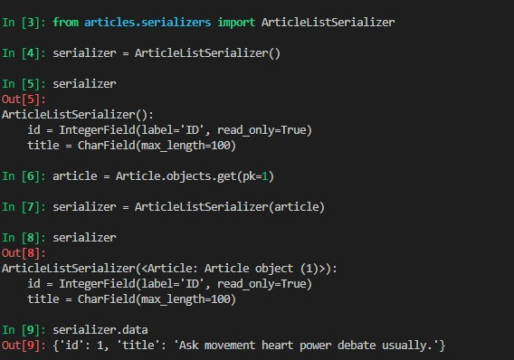
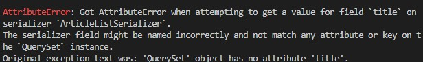
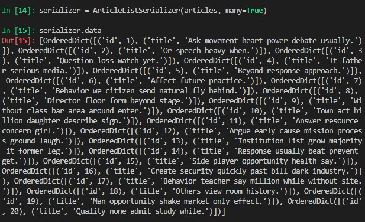

# 7_2

## shell_plus

### 5-a, 5-b


### 5-c


### 5



## code

### serializer.py
```py
from dataclasses import field
import imp
from rest_framework import serializers
from .models import Article

class ArticleListSerializer(serializers.ModelSerializer):
    class Meta:
        model = Article
        fields = ('id' , 'title')


class ArticleSerializer(serializers.ModelSerializer):

    class Meta:
        model = Article
        fields = '__all__'

```

### urls.py
```py
from django.urls import path
from . import views


urlpatterns = [
    path('articles/', views.article_list),
    path('articles/<int:article_pk>/', views.article_detail),
    
]
```


### views.py
```py

from rest_framework.response import Response
from rest_framework.decorators import api_view
from rest_framework import status

from django.shortcuts import get_list_or_404, get_object_or_404

from .serializers import ArticleListSerializer, ArticleSerializer
from .models import Article


@api_view(['GET', 'POST'])
def article_list(request):
    if request.method == 'GET':
        articles = get_list_or_404(Article)
        serializer = ArticleListSerializer(articles, many=True)
        return Response(serializer.data)

    elif request.method == 'POST':
        serializer = ArticleSerializer(data = request.data)
        if serializer.is_valid(raise_exception=True):
            serializer.save()
            return Response(serializer.data, status=status.HTTP_201_CREATED)

@api_view(['GET', 'PUT', 'DELETE'])
def article_detail(request, article_pk):
    article = get_object_or_404(Article, pk=article_pk)
    
    if request.method == 'GET':
        serializer = ArticleSerializer(article)
        return Response(serializer.data)
        

    elif request.method == 'PUT':
        serializer = ArticleListSerializer(article, data=request.data)
        if serializer.is_valid(raise_exception=True):
            serializer.save()
            return Response(serializer.data)


    elif request.method == 'DELETE':
        article.delete()
        return Response(status= status.HTTP_204_NO_CONTENT)

```