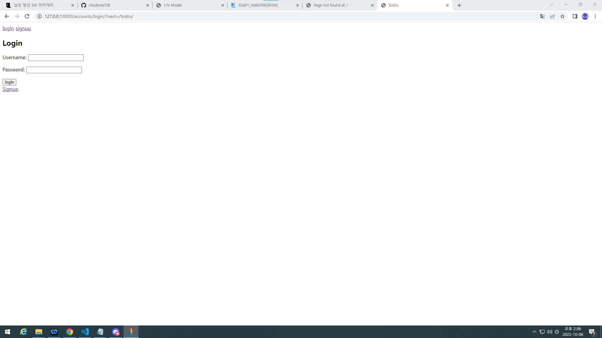
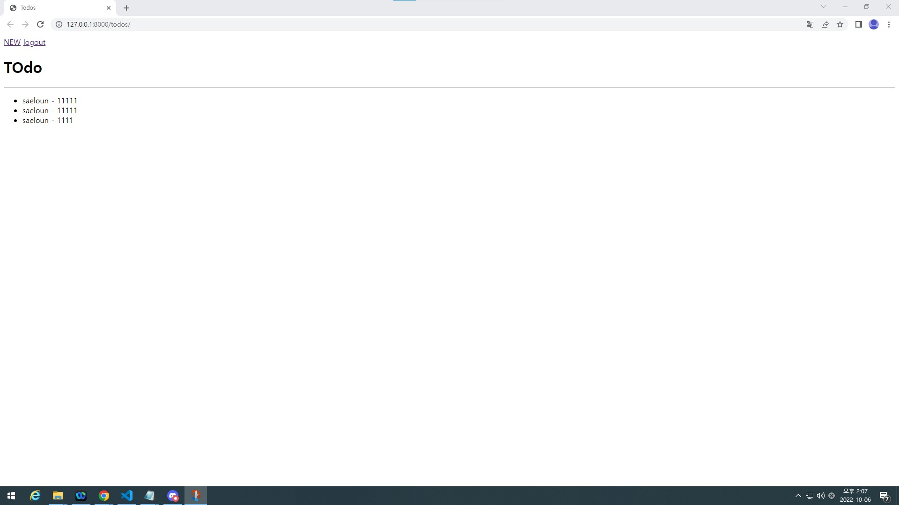
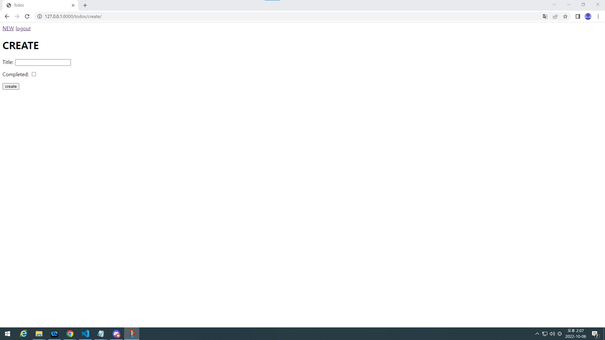

# 실습 3-1
## 결과창
    

    
    


## todos
- moelse.py
```py
from django.db import models
from django.conf import settings

# Create your models here.

class Todo(models.Model):
    author = models.ForeignKey(settings.AUTH_USER_MODEL, on_delete=models.CASCADE)
    title = models.CharField(max_length=100)
    completed = models.BooleanField(default=False)


```

- urls.py
```py
from django.urls import path
from . import views

app_name = 'todos'
urlpatterns = [
    path('', views.index, name='index'),
    path('create/', views.create, name='create'),
    
]


```

- views.py
```py
import re
from django.shortcuts import render, redirect
from django.views.decorators.http import require_http_methods, require_POST, require_safe
from django.contrib.auth.decorators import login_required
# from django.http import HttpResponse, HttpResponseForbidden
from .models import Todo
from .forms import TodoForm

# Create your views here.
@login_required                                                                                                                                                                                                                                
@require_safe
def index(request):
    if request.user.is_authenticated:
        todos = Todo.objects.all()
        context = {
            'todos' : todos,
        }
        return render(request, 'todos/index.html', context)
    else:
        return redirect('accounts:login')

@login_required
@require_http_methods(['GET', 'POST'])
def create(request):
    if request.user.is_authenticated:
        if request.method == 'POST':
            form = TodoForm(request.POST)
            if form.is_valid():
                todo = form.save(commit=False)
                todo.author = request.user
                todo.save()
                return redirect('todos:index')
        else:
            form = TodoForm()
        context = {
            'form' : form,
        }
        return render(request, 'todos/create.html', context)
    else:
        return redirect('accounts:login')


```

- forms.py
```py
from importlib.abc import ExecutionLoader
from django import forms
from .models import Todo


class TodoForm(forms.ModelForm):

    class Meta:
        model = Todo
        exclude = ['author',]

```
- index.html
```html




    <h1>TOdo</h1>

    <hr>
    <ul>
        
            <li>
                {{ todo.author }} - {{ todo.title }}
            </li>
        
            <li>작성된 글이 없습니다.</li>    
        
    </ul>




```

- create.html
```html


    <h1>CREATE</h1>
    <form action="" method="POST">
    
    {{ form.as_p }}
    <button>create</button>
    </form>




```
