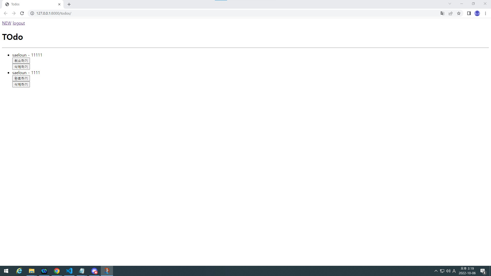
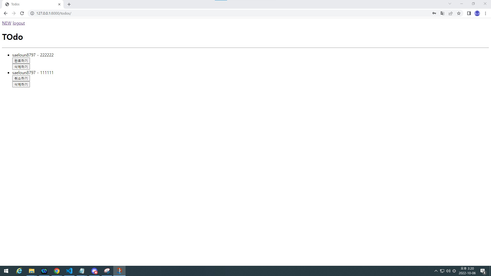

# 실습 3-2

## 결과창




## todo

- urls.py
```py
from django.urls import path
from . import views

app_name = 'todos'
urlpatterns = [
    path('', views.index, name='index'),
    path('create/', views.create, name='create'),
    path('<int:pk>/', views.toggle, name='toggle'),
    path('<int:pk>/delete', views.delete, name='delete'),
    
]

```

- views.py
```py

from django.shortcuts import render, redirect
from django.views.decorators.http import require_http_methods, require_POST, require_safe
from django.contrib.auth.decorators import login_required
# from django.http import HttpResponse, HttpResponseForbidden
from .models import Todo
from .forms import TodoForm

# Create your views here.
@login_required                                                                                                                                                                                                                                
@require_safe
def index(request):
    if request.user.is_authenticated:
        todos = Todo.objects.all()
        context = {
            'todos' : todos,
        }
        return render(request, 'todos/index.html', context)
    else:
        return redirect('accounts:login')

@login_required
@require_http_methods(['GET', 'POST'])
def create(request):
    if request.user.is_authenticated:
        if request.method == 'POST':
            form = TodoForm(request.POST)
            if form.is_valid():
                todo = form.save(commit=False)
                todo.author = request.user
                todo.save()
                return redirect('todos:index')
        else:
            form = TodoForm()
        context = {
            'form' : form,
        }
        return render(request, 'todos/create.html', context)
    else:
        return redirect('accounts:login')


def toggle(request, pk):
    todo = Todo.objects.get(pk=pk)
    if request.user.is_authenticated:
        if request.user == todo.author:
            if request.method == 'POST':
                if todo.completed:
                    todo.completed = 0
                else:
                    todo.completed = 1
                todo.save()
        return redirect('todos:index')
    else:
        return redirect('accounts:login')

@require_POST
def delete(request, pk):
    todo = Todo.objects.get(pk=pk)
    if request.user.is_authenticated:
        if request.user == todo.author:
            todo.delete()
            return redirect('todos:index')
    return redirect('accounts:login')

```

- index.html
```html




    <h1>TOdo</h1>

    <hr>

    <ul>
        
            
                <li>
                    {{ todo.author }} - {{ todo.title }}
                </li>
                <form action="" method="POST">
                    
                    
                        <button>완료하기</button>
                    
                        <button>취소하기</button>
                    
                </form>
                <form action="" method="POST">
                    
                    <button>삭제하기</button>
                </form>
            
            
        
            <li>작성된 글이 없습니다.</li>    
        
    </ul>





```